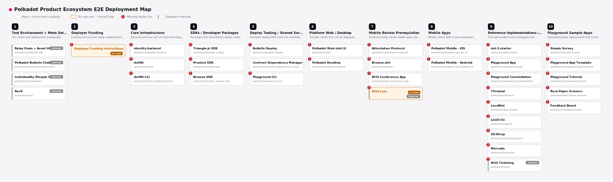

# W3S Architecture



🔗 **Live page:** https://paritytech.github.io/w3s-architecture/ · **Full-size image:** [SVG](https://raw.githubusercontent.com/paritytech/w3s-architecture/main/assets/deployment-map.svg) · [PNG](https://raw.githubusercontent.com/paritytech/w3s-architecture/main/assets/deployment-map.png)

This repo tracks the W3S open sourcing map and the related repository list used to inspect/reference project sources.

## Map Workflow

The map source of truth is `deployment-map.html`. The generated exports live in `assets/`:

- `assets/deployment-map.svg`
- `assets/deployment-map.png`

When you edit the map, update the `LAYERS` array in `deployment-map.html`, then regenerate the exports:

```sh
bash scripts/generate.sh
```

The PR workflow compares the committed SVG export against `main`, comments a before/after preview, and fails if `assets/deployment-map.svg` is out of sync with `deployment-map.html`.

## Adding Map Items

Add lanes or items in the `LAYERS` array in `deployment-map.html`.

Item fields:

- `name`: display name on the board.
- `repo`: GitHub URL, or `null` when there is no repo yet.
- `w3f`: set to `true` for internally deployed items.
- `deployDoc`: link to the deployment document when one exists. Use `"NA"` when a deploy doc is intentionally not applicable.
- `openSource`: set to `true` when the repo is public/open source, or `false` when it is private or there is no repo yet.

Items without `deployDoc` get the red `!` missing deploy doc badge. Items with `deployDoc: "NA"` do not get the badge, but still link to their repo. Items with `openSource: false` get the yellow `!` not-open-source badge. Items with `openSource: true` and any `deployDoc` value, including `"NA"`, get the green check badge. Items with `repo: null` get the `no repo` label.

## Repository List

`repos.csv` tracks repo name/URL pairs used by the clone script. It has three columns:

```csv
name,repo_name,url
```

When adding a new repo-backed map item, also add it to `repos.csv`.

## Scripts

`scripts/generate.sh` regenerates both open sourcing map exports from `deployment-map.html`.

`scripts/clone_all.sh` clones the unique repositories from `repos.csv` into `./reference-repos` over HTTPS, in parallel. `reference-repos/` is ignored by git.

```sh
bash scripts/clone_all.sh
JOBS=16 bash scripts/clone_all.sh
```

`scripts/utils/generate-svg.js` is the SVG generator used by `scripts/generate.sh`; normally call `scripts/generate.sh` instead of running it directly.
